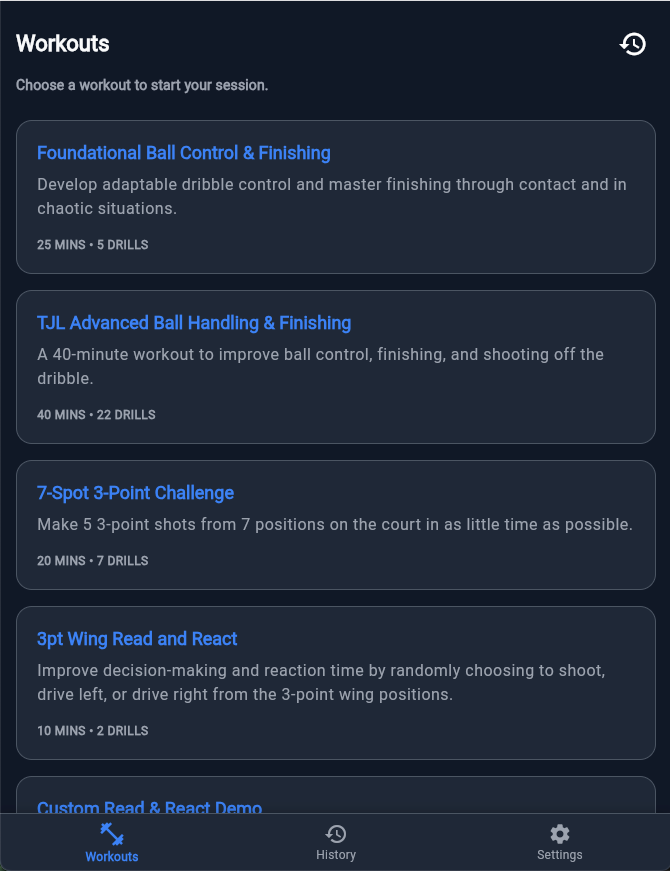
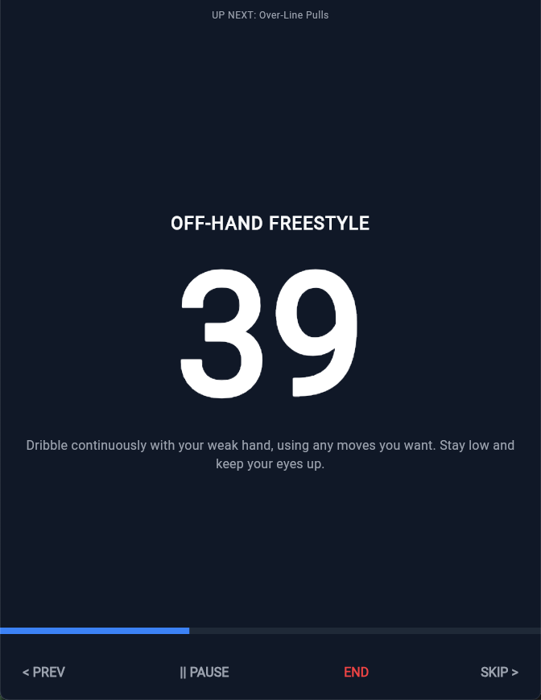
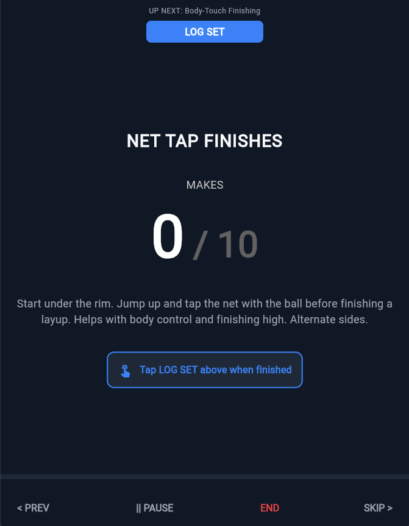
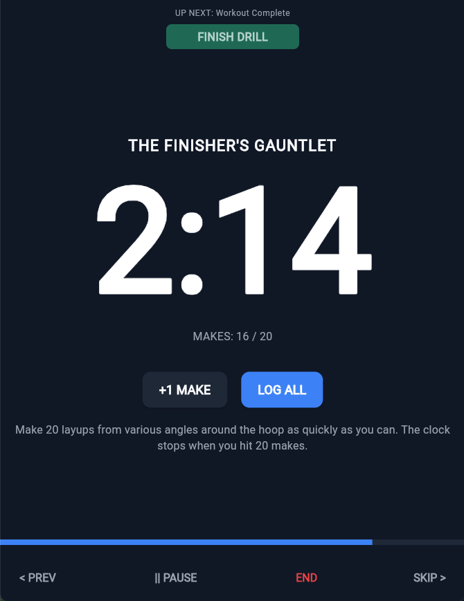
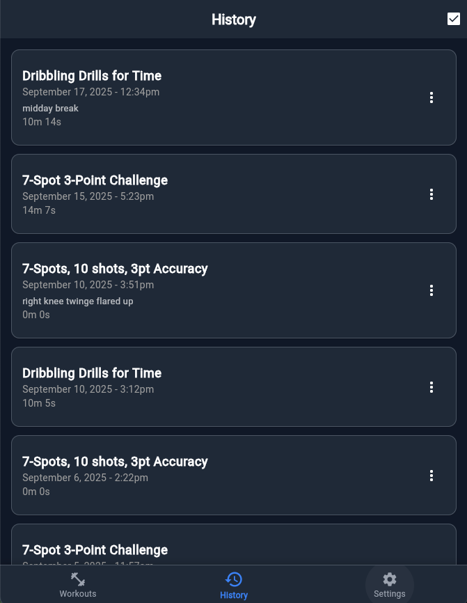
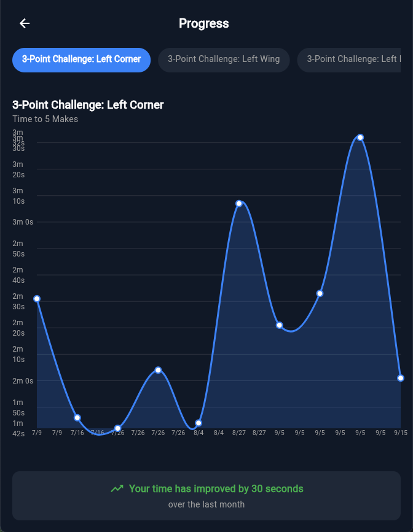
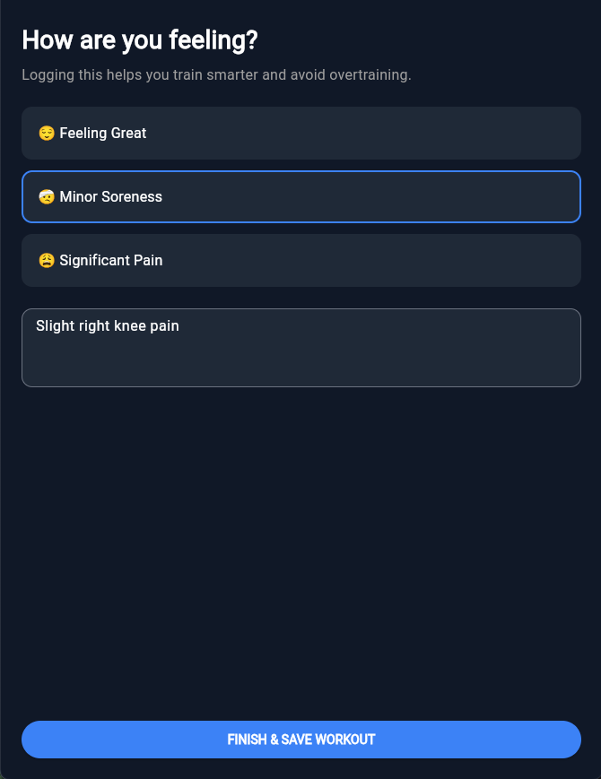

# Basketball Skills Trainer

A Flutter mobile app that helps basketball players train their skills independently with structured workout routines and progression tracking.

🏀 **[Try it live at flutter-bball-app.web.app](https://flutter-bball-app.web.app/)**

## Purpose

**Basketball Skills Trainer** eliminates the need for coaches or other players to be present during training sessions by providing:

- **Self-guided training experiences** with audio cues and structured routines
- **Comprehensive progress tracking** to measure improvement over time  
- **Multiple drill types** (timed, rep-based, make-target challenges) for varied training
- **Audio-first experience** allowing players to focus on execution rather than screen watching

> For detailed information about our mission, user personas, and key features, see [mission.md](.agent-os/product/mission.md)

## How It Works

### Workout Selection
Choose from a prebuilt list of workout routines targeting specific skills:



### Active Training Experience

**Timed Drills** - Practice with structured time limits:


**Rep-Based Drills** - Focus on repetition and form:


**Make-Target Drills** - Challenge yourself to hit specific shot counts in as little time as possible:


**Read and React Drills** - A more advanced drill type that challenges players to make a random move at the end of the interval timer. This trains a player's ability to be ready to make a move quickly, thus mimicking an in-game decision:


### Progress Tracking

**Workout History** - Track your training consistency:


**Performance Trends** - Analyze your improvement over time:


**Reflection & Notes** - Record how you felt and key insights:


## Technology Stack

Built with modern cross-platform technologies:

- **Flutter 3.8.1+** - Cross-platform mobile development
- **Dart** - Modern, type-safe programming language  
- **Firebase Suite** - Authentication, Cloud Firestore database, and hosting
- **Provider Pattern** - Scalable state management
- **Flutter TTS & AudioPlayers** - Audio guidance and sound effects
- **Material Design** - Dark theme optimized for basketball environments

> For complete technical specifications, architecture details, and platform support, see [tech-stack.md](.agent-os/product/tech-stack.md)

## AI-Powered Development

This app was developed using cutting-edge AI coding assistance:

- **Claude (Anthropic)** - Primary AI coding assistant for architecture, implementation, and debugging
- **Cursor IDE** - AI-enhanced code editor with intelligent autocomplete and refactoring
- **AI-Driven Development Workflow** - Rapid prototyping, automated testing, and iterative improvement

The combination of AI tools enabled rapid development while maintaining code quality and following Flutter best practices.

## Getting Started

1. **Clone the repository**
   ```bash
   git clone <repository-url>
   cd flutter_bball_app
   ```

2. **Install dependencies**
   ```bash
   flutter pub get
   ```

3. **Configure Firebase** (optional for basic functionality)
   - Add your Firebase configuration files
   - Update authentication settings

4. **Run the app**
   ```bash
   flutter run
   ```

## Platform Support

- ✅ **Android** - Full native support
- ✅ **Web** - Progressive Web App at [flutter-bball-app.web.app](https://flutter-bball-app.web.app/)
- 🔄 **iOS** - Framework ready, optimization in progress

---

*Train smarter. Play better. Track progress.*